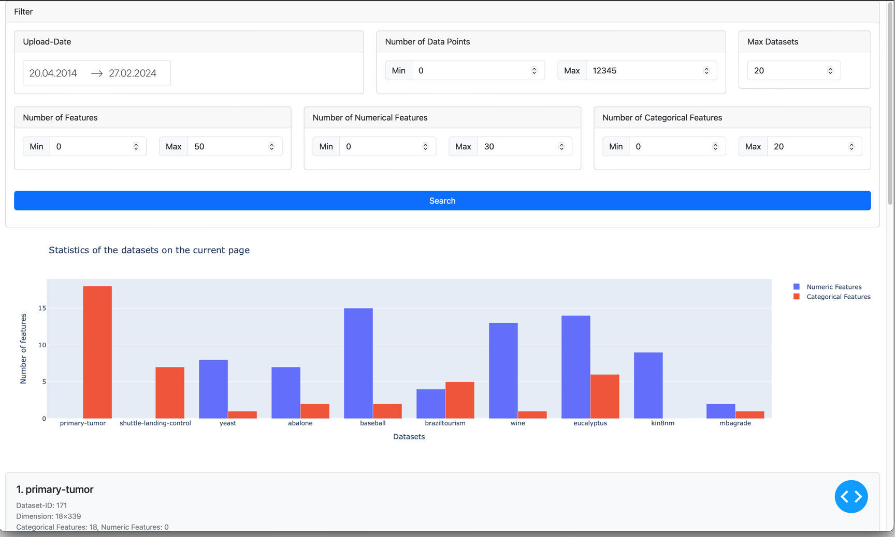

# OpenML Dataset Explorer



This project aims to provide an interface for exploring datasets hosted on OpenML (https://www.openml.org/search?type=data&sort=runs&status=active). The interface allows users to search for datasets based on various criteria and visualize the search results. It utilizes Python for accessing OpenML data and Dash for creating the web interface.

## Features

- **Dataset Filtering**: Users can filter datasets based on various criteria, such as date range, number of features, and number of instances.
- **Pagination**: The application supports pagination for large datasets, enabling users to navigate through multiple pages of results.
- **Interactive Visualization**: Users can click on dataset items to view detailed information, including histograms and summary statistics for features.
- **Error Handling**: The application includes error handling for invalid input ranges and displays error messages to users when necessary.

## Installation

1. Clone the repository to your local machine:

    ```bash
    git clone https://github.com/yourusername/dataset-explorer.git
    ```

2. Navigate to the project directory:

    ```bash
    cd dataset-explorer
    ```

3. Install the required dependencies:

    ```bash
    pip install -r requirements.txt
    ```

## Usage

1. Run the application:

    ```bash
    python main.py
    ```

2. Open a web browser and go to `http://localhost:8050` to access the application.

3. Use the filtering options to refine the dataset selection.

4. Click on dataset items to view detailed information and visualizations.

## Contributing

Contributions are welcome! If you find any bugs or have suggestions for improvements, please open an issue or submit a pull request.

## Acknowledgments

Special thanks to the Dash framework and the Plotly team for providing powerful tools for building interactive web applications in Python.
